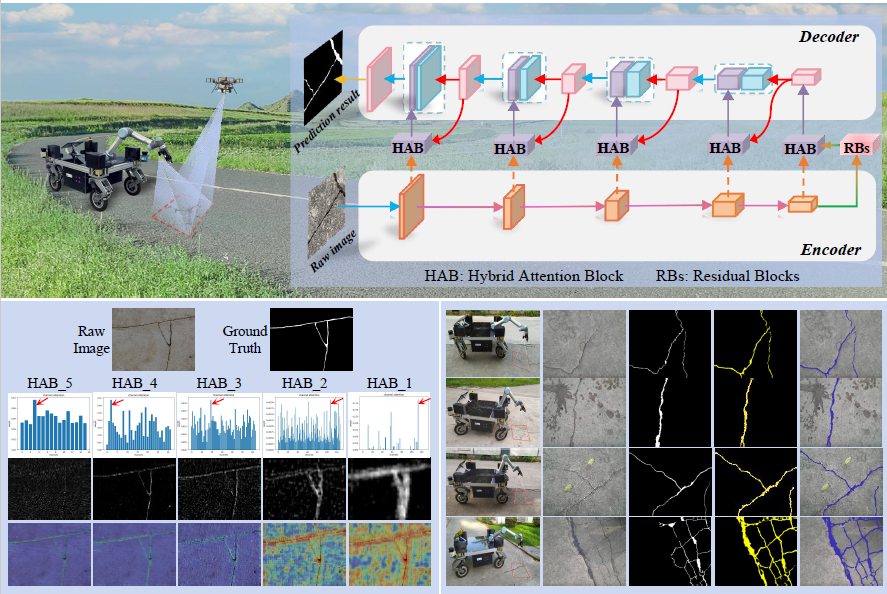
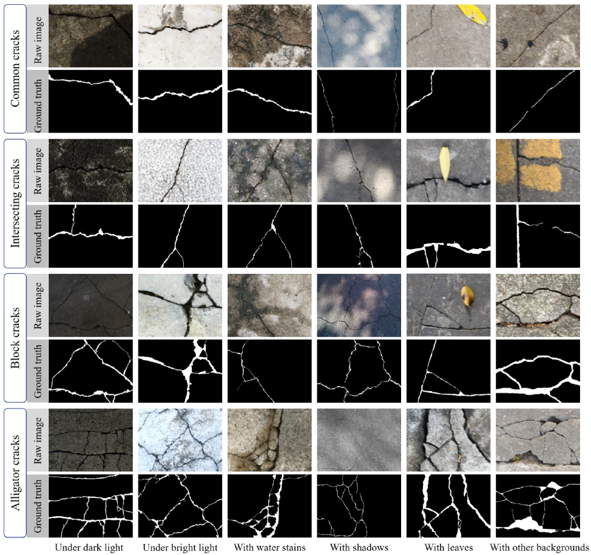
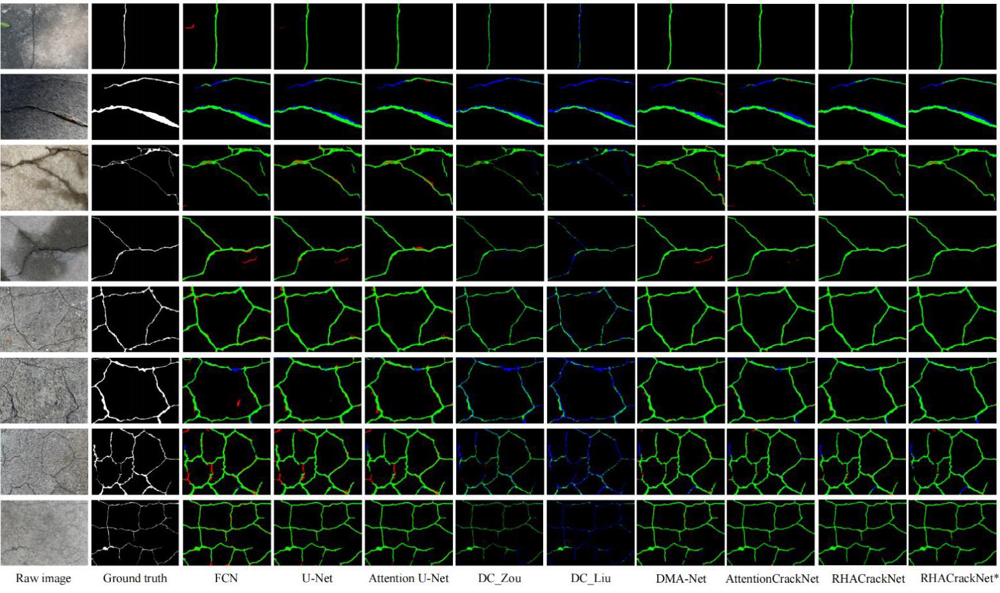

# RHACrackNet

- [English](#english) 

- [中文](#中文)

代码、论文以及数据将在DOI号放出后公布（coming soon），arxiv版本（https://arxiv.org/abs/2207.14166）


[](https://www.bilibili.com/video/BV1DN411n7wD/?vd_source=b06f0cb10036b52f98549a2223aa390e)

# English

**This is a variant neural network based on Unet, which can process and segment crack information in real-time. Currently, this paper has been included in CACAIE and is featured as the cover article.**





The proposed network can achieve an extremely lightweight model with more accurate detection of pavement crack pixels. An image dataset consisting of 789 images of pavement cracks acquired by a self-designed mobile robot is built and utilized to train and evaluate the proposed network. Comprehensive experiments demonstrate that the proposed network performs better than the state-of-the-art methods on the self-built dataset as well as three other public datasets (CamCrack789, Crack500, CFD, and DeepCrack237), achieving F1 scores of 94.94%, 82.95%, 95.74%, and 92.51%, respectively. Additionally, ablation studies validate the effectiveness of integrating the residual blocks and the proposed hybrid attention mechanisms. By introducing depth-wise separable convolutions, an even more lightweight version of the proposed network is created, which has a comparable performance and achieves the fastest inference speed with a model parameter size of only 0.57 M. The developed mobile robot system can effectively detect pavement cracks in real scenarios at a speed of 25 frames per second.





Visualization results of different models from the CamCrack789 dataset. The green, red, and blue pixels in the images represent true positives, false positives, and false negatives, respectively




<!-- ## Citation

If you found this work useful, please cite our manuscript:

```

```

## License

This work is licensed under the terms of the MIT license. -->


# 中文

**这是一个基于Unet的变种神经网络，该款神经网络可以实时处理并分割裂缝信息。目前该论文已经被CACAIE收录，并用作封面论文**


本文建立了一个由自行设计的移动机器人采集的789张路面裂缝图片的数据集，并用于训练和评估所提议的网络。综合实验表明，所提议的网络在自建数据集以及其他三个公共数据集（CamCrack789、Crack500、CFD和DeepCrack237）上的表现均优于现有的最先进方法，分别达到了94.94%、82.95%、95.74%和92.51%的F1分数。此外，消融研究验证了整合残差块和所提议的混合注意机制的有效性。通过引入深度可分离卷积，创建了一个更加轻量级的网络版本，其性能可与原网络媲美，并实现了最快的推理速度，模型参数大小仅为0.57M。开发的移动机器人系统能够在实际场景中在不经过任何模型加速的情况下，以每秒25帧的速度有效检测路面裂缝。


根据CamCrack789数据集，我们还横向对比了不同模型的可视化结果。图中的绿色、红色和蓝色像素分别代表了不同代码的真正例、假正例和假反例


<!-- ## 引用

如果您觉得这项工作有用，请引用我们的文章：

```

```

## 许可证

此项工作根据MIT许可证的条款获得许可。-->